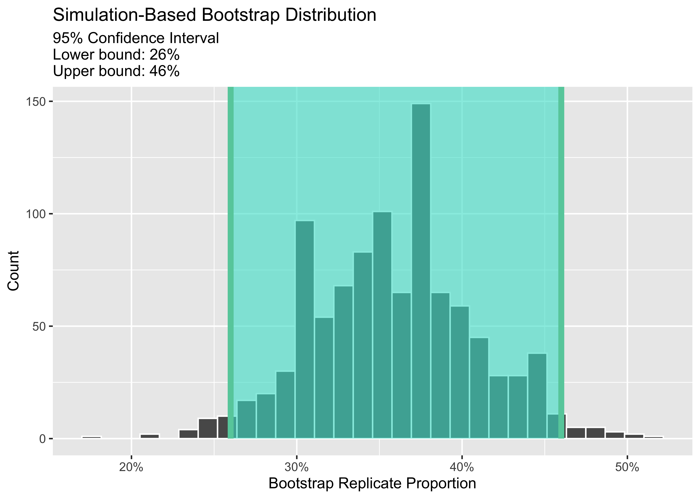
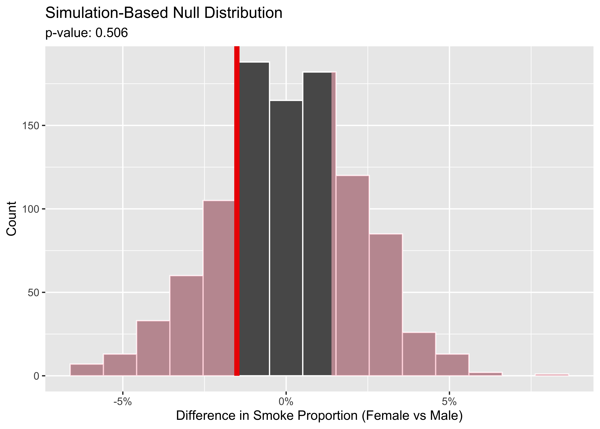
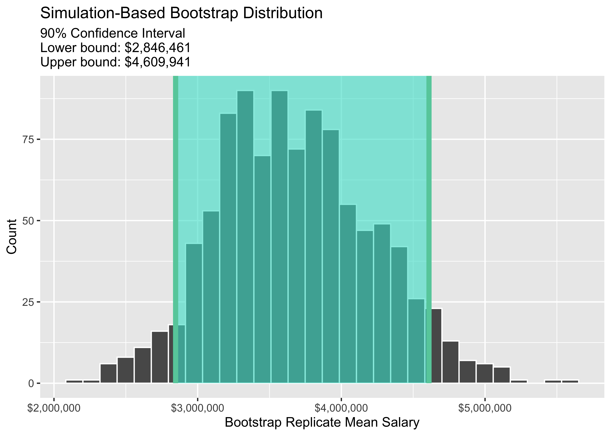
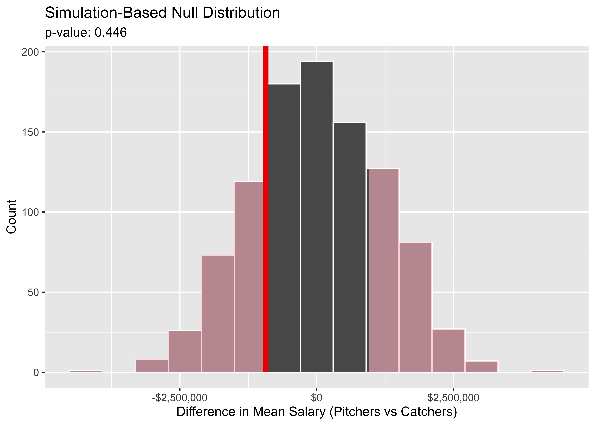
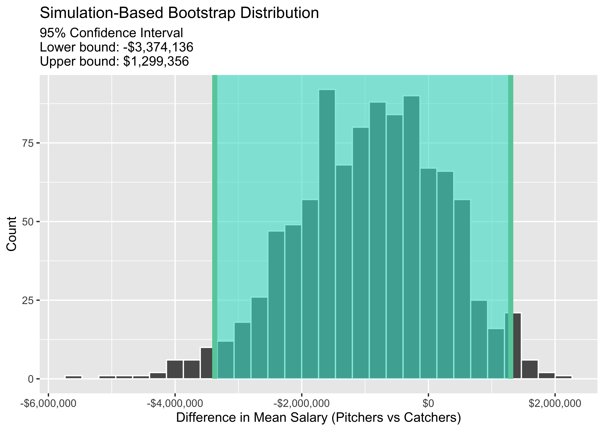
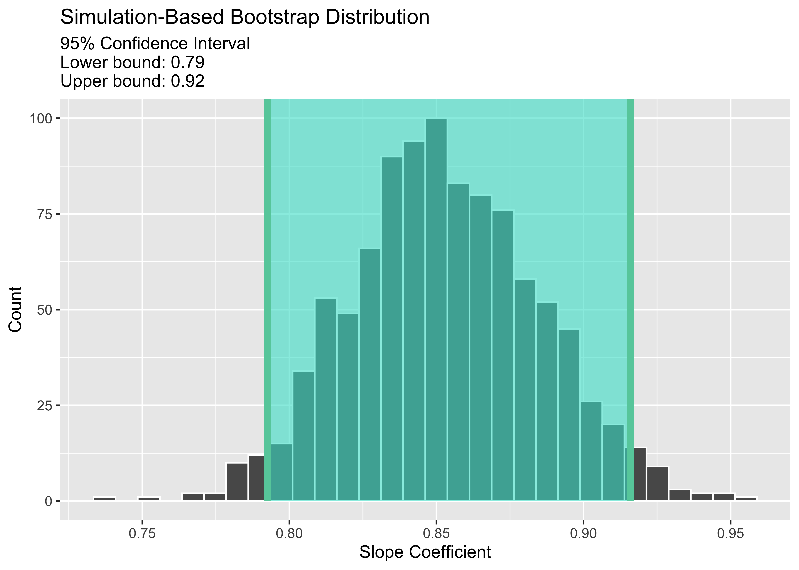
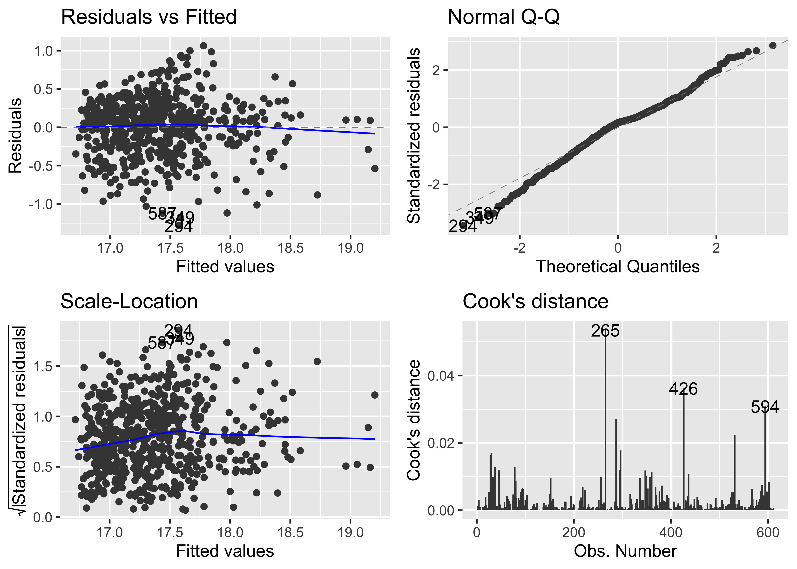

Statistical Inference with Infer R Package
================

Statistical inference notebook objective: estimate an unknown population
parameter of interest using a sample or test if a hypothesis has
sufficient supporting evidence.

Strength of the Infer package is a R tidy approach to simulation based
inference methods. Mathematical theory based approaches can also be used
when conditions are met. Simulation based methods tend to require fewer
conditions for inference and offer more straight forward methods to
visualize results. When conditions hold, we’d expect conclusions from
each method type to closely align. This notebook explores simulation
based methods for inference.

#### Common inference use cases with sample data:

  - Population proportion  
  - Difference in population proportions  
  - Population mean  
  - Difference in population means  
  - Population regression slope

<!-- end list -->

``` r
required_packages <- c('tidyverse','openintro','moderndive', 'janitor', 
                       'infer', 'scales', 'Lahman', 'skimr', 'mlbench', 
                       'AmesHousing', 'ggfortify')

for(p in required_packages){
  # if(!require(p,character.only = TRUE)) 
  #     install.packages(p, repos = "http://cran.us.r-project.org")
  library(p,character.only = TRUE)
}
```

# Population Proportion

  - Use case: estimate population proportion using random sample from
    the population. Binary category variable used to determine success
    and failure. Success case used to establish proportion metric.
  - Taking a census/counting a large population is often not feasible
    and/or resource intensive. Sample from the population can be used to
    infer about the population proportion.
  - Bootstrap simulation method: used to study the effects of sample
    variability (i.e. repeated samples with replacement). Sample
    variability expected to vary sample to sample (as the sample
    observations end up being different sample to sample in the real
    world).
  - Conditions for using bootstrap simulation: sample needs to be
    representative of the population of interest and generated without
    bias (random independent sample from the population assumed to meet
    these criteria). Watch out for small sample size. Starting point
    rule of thumb: 10 or more success and failure observations in the
    sample.

Known population which we can pretend to only have a sample of. The bowl
here represents our population of interest.

``` r
moderndive::bowl %>% tabyl(color)
```

    ##  color    n percent
    ##    red  900   0.375
    ##  white 1500   0.625

Pretend we don’t have time to count the entire bowl of 2.4k balls. We
want to estimate the red ball population proportion using a sample we
randomly generate. This general idea is how polling works. Stakeholders
don’t have time/resources to collect responses from the entire
population. As a result, pollsters attempt to collect responses from a
representative sample to estimate population parameter of interest.

``` r
set.seed(123)
bowl_sample <- bowl %>% sample_n(100)
```

Visualization of estimation process for population proportion. 95%
confident the below interval captures the value of the population
proportion of red balls.

``` r
set.seed(321)
boot_bowl_dist <- bowl_sample %>%
  specify(response=color, success="red") %>%
  generate(reps=1000, method="bootstrap") %>%
  calculate(stat="prop") 

boot_bowl_ci <- boot_bowl_dist %>%
  # standard error type can also be used if dist is normally distributed
  get_confidence_interval(level=0.95, type="percentile")

boot_bowl_ci_lower <- round(boot_bowl_ci %>% pull(lower_ci), 2)
boot_bowl_ci_upper <- round(boot_bowl_ci %>% pull(upper_ci), 2)

boot_bowl_dist %>%
  visualise(bins = 30) +
  shade_ci(endpoints = boot_bowl_ci) +
  scale_x_continuous(labels = scales::percent_format(accuracy=1)) +
  labs(subtitle = paste0("95% Confidence Interval\n", 
                         "Lower bound: ", 
                         scales::percent(boot_bowl_ci_lower),
                         "\nUpper bound: ",
                         scales::percent(boot_bowl_ci_upper)),
       x="Bootstrap Replicate Proportion",
       y="Count")
```

<!-- -->

## Difference in Group Proportions

  - Use case: hypothesis test comparing the difference in proportions
    between two groups of random samples from a population. For example,
    experiment design where treatment and control are randomized then we
    compare treatment success rate vs control success rate.
  - Null hypothesis: group 1 proportion = group 2 proportion
  - Alternative hypothesis: group 1 proportion \!= group 2 proportion
  - Bootstrap simulation often used to derive confidence interval for
    inference. Permutation simulation can be used to derive p-value.
    Permutation simulation shuffles the proportion variable to generate
    the null distribution of no difference in group proportions.
  - Conditions: observations are independent between and within groups
    (i.e. knowing one value doesn’t give us information about another
    value). Watch out for small sample size. Starting point rule of
    thumb: 10 or more success and failure observations in the sample.

#### Investigate UK smoking survey data:

  - Null: no difference in smoking rates between females and males
  - Alt: there is a difference smoking rates between females and males

To validate independence conditions we’d need to learn more about the
data collection process (assuming conditions are met for this example).
Success and failure observation condition passes.

``` r
smoking %>%
  tabyl(gender, smoke) %>%
  adorn_percentages(denominator = "row") %>% 
  adorn_pct_formatting(digits = 0) %>%
  adorn_ns(position = "front")
```

    ##  gender        No       Yes
    ##  Female 731 (76%) 234 (24%)
    ##    Male 539 (74%) 187 (26%)

Female vs male difference in smoking proportion hypothesis test (alpha
significance level = 0.05). 0.498 p-value is represented by shaded
region below. P-value represents the probability of observing a
difference as extreme or more extreme as the one observed assuming the
null distribution is true.

We fail to reject the null hypothesis given the p-value is above our
specified alpha significance level. Said differently, we don’t have
enough evidence to reject the null hypothesis.

Bootstrap simulation can be used to generate confidence interval for
difference in proportions. Not as relevant for this example given
p-value is not close to significance level.

``` r
diff_in_smoke_prop_point_estimate <- smoking %>%
      specify(formula = smoke ~ gender, success = "Yes") %>%
      calculate(stat="diff in props", order = c("Female", "Male"))

set.seed(321)
smoke_null_dist <- smoking %>%
      specify(formula = smoke ~ gender, success = "Yes") %>%
      hypothesise(null="independence") %>%
      generate(reps=1000, type="permute") %>%
      calculate(stat="diff in props", order = c("Female", "Male"))

pvalue_diff_in_smoke_prop <- smoke_null_dist %>%
  get_pvalue(obs_stat = diff_in_smoke_prop_point_estimate, direction = "both")

smoke_null_dist %>%
  visualise() +
  shade_pvalue(obs_stat = diff_in_smoke_prop_point_estimate,
               direction = "both") +
  scale_x_continuous(labels = scales::percent_format(accuracy=1)) +
  labs(subtitle = paste0("p-value: ", 
                         round(pvalue_diff_in_smoke_prop,5)),
       x="Difference in Smoke Proportion (Female vs Male)",
       y="Count")
```

<!-- -->

# Population mean

  - Use case: we’re not able to calculate a population mean of interest
    due to lack of data, resourcing, or feasibility. We can use a random
    sample to estimate the population mean.
  - Bootstrap simulation used to derive confidence interval for
    population mean estimation.
  - Conditions: sample observations are independent and sample size is
    as large as possible. Estimation might be unstable for small
    samples.

Note: in practice, we wouldn’t have the population parameter of interest
hence the need for using a sample to infer about the population. If we
have data on the full population with the parameter of interest then we
simply derive the population mean on the full population (inference not
needed).

Using MLB baseball player salary data for this example.

``` r
player_sal_2016 <- Lahman::Salaries %>% 
  filter(yearID==2016)
# skim(player_sal_2016, salary)
```

Let’s pretend we don’t have the salary data on all MLB baseball players
from 2016. For some reason we can only get salary data for a random
sample of 50 players. We’ll use the sample to estimate the population
salary mean in 2016. The sample mean below is one form of estimating the
population mean. However, confidence interval method below is preferred
as it accounts for sampling variability.

``` r
set.seed(162)
sample_player_sal_2016 <- Salaries %>% 
  filter(yearID==2016) %>%
  sample_n(50)
```

Sample point estimate for population mean.

``` r
sample_player_sal_2016 %>% 
  summarise(sample_average_player_salary = dollar(mean(salary)))
```

    ##   sample_average_player_salary
    ## 1                   $2,476,822

Estimate population mean using bootstrap simulation. 90% confident
player average salary is between `~$3.67M` and `~$6.46M`. The confidence
interval is the plausible range for the population mean. 90% confident:
is the notion that over the long run if we were to take repeated samples
we’d expect 90% of the intervals to capture the true population mean.

We can confirm the confidence interval captures the population mean of
interest. This wouldn’t be the case in practice as the population mean
would be unknown and we’ll use the sample to estimate the population
mean.

``` r
set.seed(162)
boot_sal_dist <- sample_player_sal_2016 %>%
  specify(response=salary) %>%
  generate(reps=1000, method="bootstrap") %>%
  calculate(stat="mean") 

boot_sal_ci <- boot_sal_dist %>%
  get_confidence_interval(level=0.9, type="percentile")

boot_sal_ci_lower <- round(boot_sal_ci %>% pull(lower_ci), 2)
boot_sal_ci_upper <- round(boot_sal_ci %>% pull(upper_ci), 2)

boot_sal_dist %>%
  visualise(bins = 30) +
  shade_ci(endpoints = boot_sal_ci) +
  scale_x_continuous(labels=scales::dollar_format()) +
  labs(subtitle = paste0("90% Confidence Interval\n", 
                         "Lower bound: ", 
                         dollar(boot_sal_ci_lower, 1),
                         "\nUpper bound: ",
                         dollar(boot_sal_ci_upper, 1)),
       x="Bootstrap Replicate Mean Salary",
       y="Count")
```

<!-- -->

# Difference in population means

  - Use case: do group means differ in the population of interest?
    i.e. do MLB pitchers have different average salaries than MLB
    catchers?
  - Null hypothesis: diff between average MLB pitcher salary and average
    MLB catcher salary = 0
  - Alt hypothesis: diff between average MLB pitcher salary and average
    MLB catcher salary \!= 0
  - Conditions: sample observations are independent within and between
    groups. Sample size is as large as possible. Estimation might be
    unstable for small samples.

For sake of example, we’ll assume the below sample data meets required
conditions and addresses question of interest. In practice, more care is
given to validating and crafting sample data. Technically, the below
sample data is biased to players who had appearances in the 2016 season
and had salary data available. Again, we’ll pretend the population data
isn’t available and the sample of pitcher/catcher data is useful.

``` r
position_info_2016_season <- Appearances %>%
  filter(yearID==2016) %>%
  group_by(playerID) %>%
  summarise(games_pitcher = sum(G_p),
            games_catcher = sum(G_c),
            .groups = 'drop') %>%
  filter(games_pitcher>0 | games_catcher>0) %>%
  mutate(position_label = case_when(
    games_pitcher == games_catcher ~ 'hybrid',
    games_pitcher > games_catcher ~ 'pitcher',
    games_pitcher < games_catcher ~ 'catcher',
    T ~ 'error'
    )
  )

players_with_sal_info <- position_info_2016_season %>%
  inner_join(player_sal_2016, by=c("playerID"))

set.seed(333)
sample_players_with_sal_info <- players_with_sal_info %>%
  group_by(position_label) %>%
  sample_n(25) %>%
  ungroup()
```

Sample point estimate for difference in average salary.

``` r
obs_stat_sal_diff <- sample_players_with_sal_info %>%
  specify(formula = salary ~ position_label) %>%
  calculate(stat = c("diff in means"), order = c("pitcher", "catcher"))

obs_stat_sal_diff %>% pull(stat) %>% dollar()
```

    ## [1] "-$928,623"

Visualize null distribution and p-value (alpha significance level 0.05).
P-value above 0.05. We fail to reject the null hypothesis. We don’t have
enough evidence to suggest there’s a difference in average salary.

``` r
set.seed(333)
diff_sal_null_dist <- sample_players_with_sal_info %>%
  specify(formula = salary ~ position_label) %>%
  hypothesise(null = "independence") %>%
  generate(reps = 1000, type = "permute") %>%
  calculate(stat = c("diff in means"), order = c("pitcher", "catcher"))

pvalue_sal_diff <- diff_sal_null_dist %>%
  get_pvalue(obs_stat = obs_stat_sal_diff, direction = "both")

diff_sal_null_dist %>%
  visualise() +
  shade_pvalue(obs_stat = obs_stat_sal_diff, direction = "both") +
  scale_x_continuous(labels=scales::dollar_format()) +
  labs(subtitle = paste0("p-value: ", 
                       round(pvalue_sal_diff,5)),
     x="Difference in Mean Salary (Pitchers vs Catchers)",
     y="Count")
```

<!-- -->

We can also use bootstrap simulation to generate a confidence interval
for the difference in average salary. Confidence interval contains zero
which suggests we don’t have enough evidence to reject the null
hypothesis that the difference between average salary is zero. In other
words, at 95% confidence, it’s plausible that true population difference
in average salary is between `-$686k` and `$4.2M` (which includes zero
so it’s plausible the true difference might be zero).

``` r
set.seed(333)
diff_sal_boot_dist <- sample_players_with_sal_info %>%
  specify(formula = salary ~ position_label) %>%
  generate(reps = 1000, type = "bootstrap") %>%
  calculate(stat = c("diff in means"), order = c("pitcher", "catcher"))

boot_diff_sal_ci <- diff_sal_boot_dist %>%
  get_confidence_interval(level=0.95, type="percentile")

diff_sal_ci_lower <- round(boot_diff_sal_ci %>% pull(lower_ci), 2)
diff_sal_ci_upper <- round(boot_diff_sal_ci %>% pull(upper_ci), 2)

diff_sal_boot_dist %>%
  visualise(bins = 30) +
  shade_ci(endpoints = boot_diff_sal_ci) +
  scale_x_continuous(labels=scales::dollar_format()) +
  labs(subtitle = paste0("95% Confidence Interval\n", 
                         "Lower bound: ", 
                         dollar(diff_sal_ci_lower, 1),
                         "\nUpper bound: ",
                         dollar(diff_sal_ci_upper, 1)),
       x="Difference in Mean Salary (Pitchers vs Catchers)",
       y="Count")
```

<!-- -->

# Population regression slope

  - Use case: Using a sample to infer about a population, does the
    regression line for a sample have a non-zero slope? i.e. is there an
    association between house price sold and house living areas square
    feet?
  - Null hypothesis: slope = 0
  - Alt hypothesis: slope \!= 0
  - We can use similar permutation and bootstrap simulation methods
    applied above.
  - Conditions for regression inference (important for theory based
    approaches; using similar checks for simulation based approaches):
    ==\> L: linear relationship ==\> I: observations are independent
    (knowing one doesn’t give us information about the other) ==\> N:
    normality of residuals ==\> E: equal variance of residuals across
    values of predictors (not funnel shaped)
  - Also, watch out for outliers and small sample sizes. “L”, “N”, “E”
    tend to be confirmed via residual visual analysis (sophisticated
    statistical approaches can also be used). “I” needs to be confirmed
    in context of the analysis problem.

Pretend we’re a real estate agent and we only sell residential homes 750
sqft or larger in Ames, Iowa. We’re able to get a random sample of home
sales data for our region of interest.

``` r
data(ames) ### ames from AmesHousing package

ames_2006_750_sqft_or_more <- ames %>%
  filter(Yr.Sold==2006,
         area>=750) %>%
  mutate(
    # log2 to transform relationship to more linear trend
    log2_price = log2(price),
    # convert area to sqft in thousands to make coefficient more intuitive
    area_thousands = area/1000
  )
```

Note: inference calcs faster using get\_regressions\_table(). This
approach uses mathematical theory based formulas for generating table
columns. Also, in practice, we apply more robust EDA methods before
jumping straight to model statistical inference.

``` r
# lm(log2_price ~ area_thousands, data=ames_2006_750_sqft_or_more) %>% 
#   get_regression_table()
```

Visualize relationship of interest. Likely improvements we can make with
the model fit. However, focusing this notebook on the inference elements
of analysis.

``` r
ames_2006_750_sqft_or_more %>%
  ggplot(aes(x=area_thousands,
             y=log2_price)) +
  geom_point() +
  geom_smooth(method = "lm", se = F) +
  labs(title="2006 Ames: Home Sale Price and Living Area",
       y="Log2 Price",
       x="Above Ground Living Area (Square feet in Thousands)")
```

<!-- -->

Alpha significance level 0.05. P-value is very small (near zero).
Evidence to reject null hypothesis in favor of the alternative
hypothesis.

``` r
set.seed(805)
obs_stat_hprice <- ames_2006_750_sqft_or_more %>%
  specify(formula = log2_price ~ area_thousands) %>%
  calculate(stat="slope")

set.seed(805)
null_dist_hprice <- ames_2006_750_sqft_or_more %>%
  specify(formula = log2_price ~ area_thousands) %>%
  ### independence null meaning knowing area var is not useful in determining price
  hypothesise(null="independence") %>%
  generate(reps=1000, type="permute") %>%
  calculate(stat="slope") 

pvalue_hprice <- null_dist_hprice %>%
  get_p_value(direction="both", obs_stat=obs_stat_hprice)

null_dist_hprice %>%
  visualize() + 
  shade_p_value(direction="both", obs_stat=obs_stat_hprice) +
  labs(subtitle = paste0("p-value: ", pvalue_hprice),
       x="Slope Coefficient")
```

<!-- -->

95% confidence bootstrap interval suggests we’re 95% confident that true
population slope is between 0.84 and 0.96. In other words, on average,
for every 1000 square foot increase in living areas we’d expect log2
price to increase between 0.84 and 0.96. We can visually tie this with
the linear regression line visualized above.

``` r
set.seed(805)
boot_dist_hprice <- ames_2006_750_sqft_or_more %>%
  specify(formula = log2_price ~ area_thousands) %>%
  generate(reps=1000, type="bootstrap") %>%
  calculate(stat="slope") 

boot_hprice_ci <- boot_dist_hprice %>%
  get_confidence_interval(level=0.95, type="percentile")

hprice_ci_lower <- round(boot_hprice_ci %>% pull(lower_ci), 2)
hprice_ci_upper <- round(boot_hprice_ci %>% pull(upper_ci), 2)

boot_dist_hprice %>%
  visualise(bins = 30) +
  shade_ci(endpoints = boot_hprice_ci) +
  labs(subtitle = paste0("95% Confidence Interval\n", 
                         "Lower bound: ", 
                         round(hprice_ci_lower, 2),
                         "\nUpper bound: ",
                         round(hprice_ci_upper, 2)),
       x="Slope Coefficient",
       y="Count")
```

<!-- -->

Example of how we can visually assess conditions. This part is
subjective without clear black and white rules. Residuals are left
skewed but some might consider the distribution close enough to normal.
In practice, we’d investigate the residual plots further. If conditions
aren’t fully met then results should be tagged as
provisional/inspirational.

``` r
fit <- lm(log2_price ~ area_thousands, data=ames_2006_750_sqft_or_more)
ggplot2::autoplot(fit, which = 1:4)
```

<!-- -->

This is a quick glimpse of what can be done with the [Infer
package](https://infer.netlify.app/). The package can handle many more
inference use cases/scenarios.

### Recommended Learning Resources

  - [Statistical Inference via Data Science: A ModernDive into R and the
    Tidyverse](https://moderndive.com/)
  - [Introduction to Modern
    Statistics](https://openintro-ims.netlify.app/)
